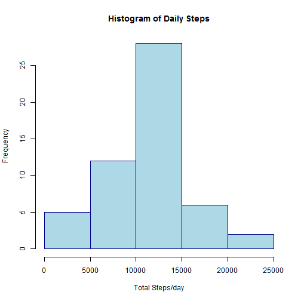
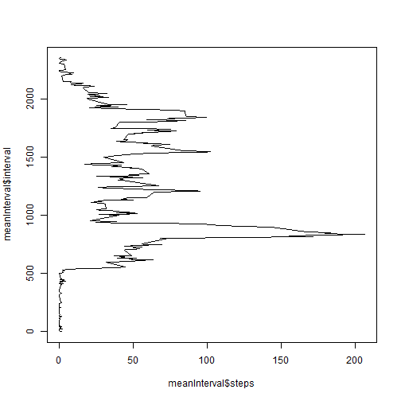
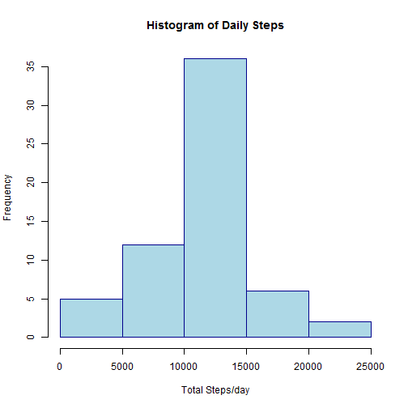

## Loading and preprocessing the data


```r
# set the filename and load it into a data frame
datafile <- "activity/activity.csv"
setwd("C:/Users/david/datasciencecoursera/Reproducible Research/Week2/Project1/RepData_PeerAssessment1")
df <- read.csv(datafile)
```


## What is mean total number of steps taken per day?
Calculate the total steps by day


```r
# total the steps by date
totalSteps <- aggregate(steps ~ date, df, sum)
head(totalSteps)
```

```
##         date steps
## 1 2012-10-02   126
## 2 2012-10-03 11352
## 3 2012-10-04 12116
## 4 2012-10-05 13294
## 5 2012-10-06 15420
## 6 2012-10-07 11015
```

Then make a histogram of the result


```r
hist(totalSteps$steps, main = "Histogram of Daily Steps",
     border = "dark blue", col = "light blue", xlab="Total Steps/day")
```

 

The mean of the daily steps


```r
# calculate the mean of the daily steps
mean(totalSteps$steps)
```

```
## [1] 10766.19
```

The median of the daily steps


```r
# and calculate the median number of steps
median(totalSteps$steps)
```

```
## [1] 10765
```

## What is the average daily activity pattern?
Make a time-series plot
First, let's determine the mean for each interval

```r
meanInterval <- aggregate( steps ~ interval, df, mean, na.action="na.exclude")
head(meanInterval)
```

```
##   interval     steps
## 1        0 1.7169811
## 2        5 0.3396226
## 3       10 0.1320755
## 4       15 0.1509434
## 5       20 0.0754717
## 6       25 2.0943396
```

Now do a time series plot


```r
plot( meanInterval$steps, meanInterval$interval, type="l")
```

 

Determine which 5 minute interval has the maximum number of steps


```r
# find the maximum number of steps in any interval
max(meanInterval$steps)
```

```
## [1] 206.1698
```

```r
# what is the index of the maximum number of steps
which.max(meanInterval$steps)
```

```
## [1] 104
```

```r
# which interval is it
meanInterval[which.max(meanInterval$steps),1]
```

```
## [1] 835
```


## Imputing missing values
Calculate and report the total number of missing values in the dataset (i.e. the total number of rows with NAs)


```r
sum(is.na(df$steps))
```

```
## [1] 2304
```

Devise a strategy for filling in all of the missing values in the dataset. The strategy does not need to be sophisticated. For example, you could use the mean/median for that day, or the mean for that 5-minute interval, etc.

For my strategy I choose to use the mean of the equivalent 5-minute interval to populate any NA values.

Create a new dataset that is equal to the original dataset but with the missing data filled in.


```r
# create a new data frame
dfCopy <- df

for (i in 1:nrow(dfCopy)) 
{ 
  if ( is.na(dfCopy[i,1]) ) {
    dfCopy[i,1] <- meanInterval[meanInterval$interval == dfCopy[i,3] ,2]
  }
}
```

Let's compare the initial dataset to the new one to show some replaced NA values.


```r
head(df)
```

```
##   steps       date interval
## 1    NA 2012-10-01        0
## 2    NA 2012-10-01        5
## 3    NA 2012-10-01       10
## 4    NA 2012-10-01       15
## 5    NA 2012-10-01       20
## 6    NA 2012-10-01       25
```

```r
head(dfCopy)
```

```
##       steps       date interval
## 1 1.7169811 2012-10-01        0
## 2 0.3396226 2012-10-01        5
## 3 0.1320755 2012-10-01       10
## 4 0.1509434 2012-10-01       15
## 5 0.0754717 2012-10-01       20
## 6 2.0943396 2012-10-01       25
```

Make a histogram of the total number of steps taken each day and Calculate and report the mean and median total number of steps taken per day. Do these values differ from the estimates from the first part of the assignment? What is the impact of imputing missing data on the estimates of the total daily number of steps?


```r
# total the steps by date
totalStepsCopy <- aggregate(steps ~ date, dfCopy, sum)
head(totalStepsCopy)
```

```
##         date    steps
## 1 2012-10-01 10766.19
## 2 2012-10-02   126.00
## 3 2012-10-03 11352.00
## 4 2012-10-04 12116.00
## 5 2012-10-05 13294.00
## 6 2012-10-06 15420.00
```

```r
# Then make a histogram of the result
hist(totalStepsCopy$steps, main = "Histogram of Daily Steps",
     border = "dark blue", col = "light blue", xlab="Total Steps/day")
```

 

The mean of the daily steps


```r
# calculate the mean of the daily steps
mean(totalStepsCopy$steps)
```

```
## [1] 10766.19
```

The median of the daily steps


```r
# and calculate the median number of steps
median(totalStepsCopy$steps)
```

```
## [1] 10766.19
```


## Are there differences in activity patterns between weekdays and weekends?
For this part the weekdays() function may be of some help here. Use the dataset with the filled-in missing values for this part.

Create a new factor variable in the dataset with two levels - "weekday" and "weekend" indicating whether a given date is a weekday or weekend day.


```r
# Create datatype as a new factor, do a summary of the dataframe to show 
# that both weekday & weekend are used
dfCopy$datetype <- as.factor(ifelse( weekdays(as.Date(dfCopy$date)) %in% c("Saturday", "Sunday"), "weekend", "weekday") )
summary(dfCopy)
```

```
##      steps                date          interval         datetype    
##  Min.   :  0.00   2012-10-01:  288   Min.   :   0.0   weekday:12960  
##  1st Qu.:  0.00   2012-10-02:  288   1st Qu.: 588.8   weekend: 4608  
##  Median :  0.00   2012-10-03:  288   Median :1177.5                  
##  Mean   : 37.38   2012-10-04:  288   Mean   :1177.5                  
##  3rd Qu.: 27.00   2012-10-05:  288   3rd Qu.:1766.2                  
##  Max.   :806.00   2012-10-06:  288   Max.   :2355.0                  
##                   (Other)   :15840
```


Make a panel plot containing a time series plot (i.e. type = "l") of the 5-minute interval (x-axis) and the average number of steps taken, averaged across all weekday days or weekend days (y-axis). See the README file in the GitHub repository to see an example of what this plot should look like using simulated data.


```r
meanIntervalCopy <- aggregate( steps ~ interval, dfCopy, mean)
par( mfrow = c(2,1))
plot( subset(meanIntervalCopy, meanIntervalCopy$datetype == "weekend", select = c(meanIntervalCopy$interval, meanIntervalCopy$steps)) , type="l")
```

```
## Error in `[.data.frame`(x, r, vars, drop = drop): undefined columns selected
```

```r
plot( subset(meanIntervalCopy, meanIntervalCopy$datetype == "weekday", select = c(meanIntervalCopy$interval, meanIntervalCopy$steps)) , type="l", ylab="Time")
```

```
## Error in `[.data.frame`(x, r, vars, drop = drop): undefined columns selected
```

